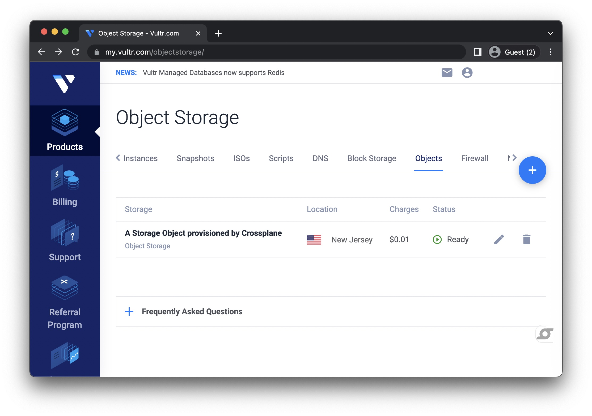

# Provider Vultr

`provider-vultr` is a [Crossplane](https://crossplane.io/) provider that
is built using [Upjet](https://github.com/upbound/upjet) code
generation tools and exposes XRM-conformant managed resources for the
[Vultr](vultr.com) API.

Status: POC

## Getting Started

Prerequisites: Go, K8s Cluster with Crossplane installed and a Vultr account:

Test the API with curl:
```bash
# get from https://my.vultr.com/settings/#settingsapi
export VULTR_API_KEY=<YOUR API KEY>
# get all storage object
curl "https://api.vultr.com/v2/object-storage" -X GET -H "Authorization: Bearer ${VULTR_API_KEY}"
# create an example storage object
curl "https://api.vultr.com/v2/object-storage" -X POST -H "Authorization: Bearer ${VULTR_API_KEY}" -H "Content-Type: application/json" --data '{"label" : "Example Object Storage from Curl","cluster_id" : 2}'
```

Next install this Vultr Crossplane provider:
```bash
# clone this repo
git clone git@github.com:luebken/provider-vultr.git
cd provider-vultr

# install the crds
kubectl apply -f package/crds
```

Run the provider:
```bash
make run
```

Configure the provider:
```bash
# !!! change the exampels/secret.yaml to use your VULTR_API_KEY
kubectl apply -f examples/providerconfig/secret.yaml
kubectl apply -f examples/providerconfig/providerconfig.yaml
```

Create a [storage object](examples/object/storage.yaml):
```bash
kubectl apply -f exampels/object/storage.yaml
# wait a bit

kubectl get storage
NAME                    READY   SYNCED   EXTERNAL-NAME                          AGE
sample-storage-object   True    True     24ef0c3c-0dd4-4fe9-905e-953360a12332   4m22s
```

🎉

Now when you open [my.vultr.com/objectstorage](https://my.vultr.com/objectstorage/), you will something like the following:




